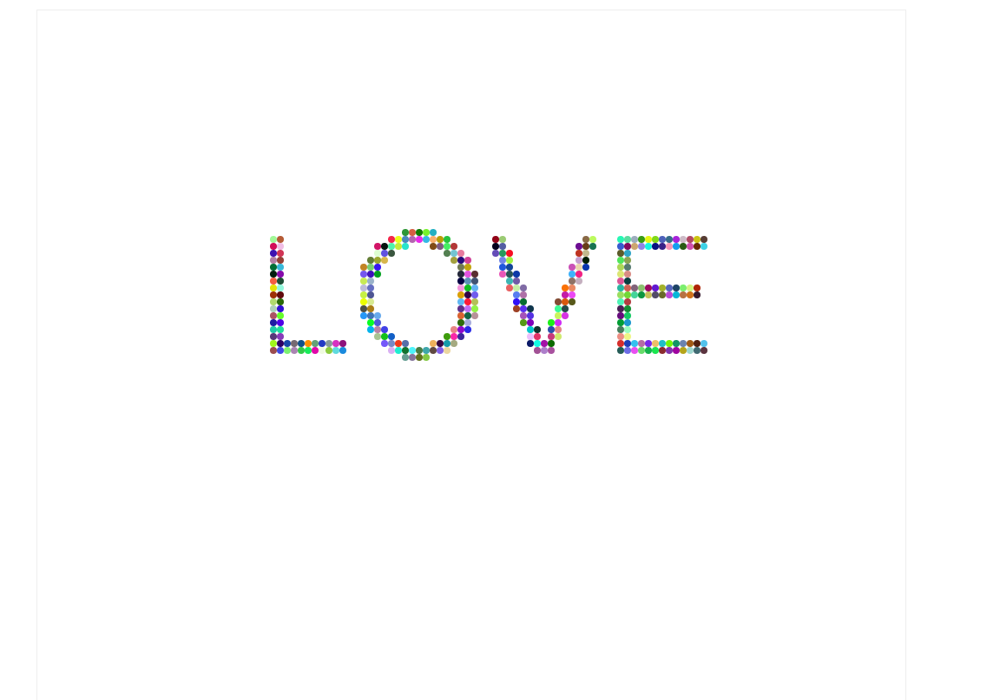
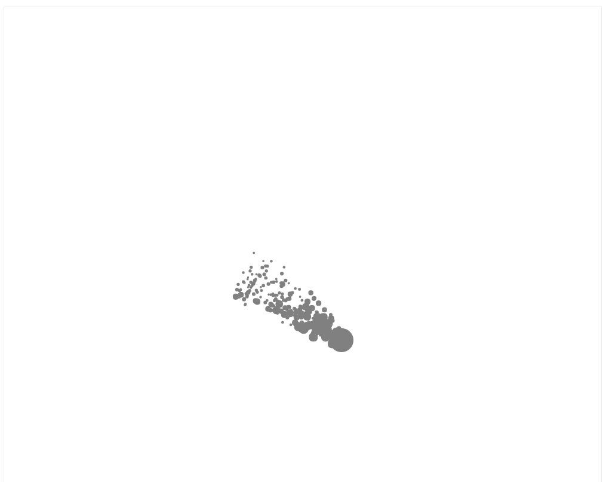
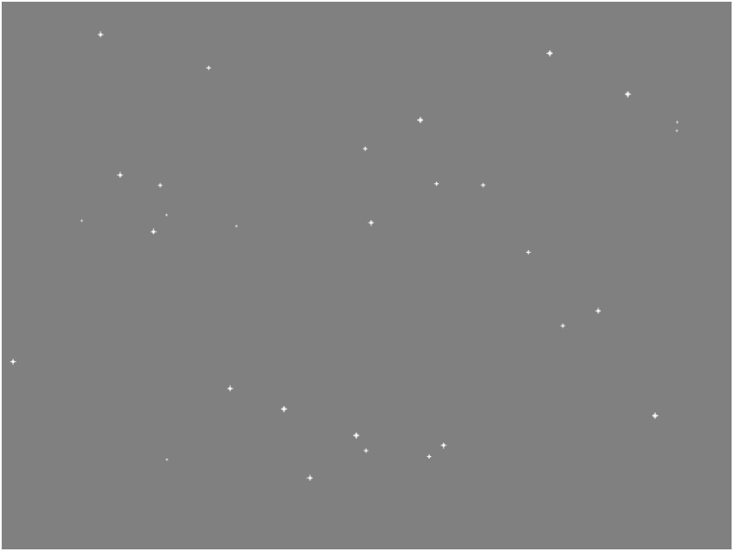

# cartoon.js
an animation library for your web based on canvas</br>
cartoon.js是一个基于Web和Html5的图形动画库，去框架化，功能独立，上手简单易用。</br>
</br>

```
#install
npm install cartoon.js
在页面中引入cartoon.min.js文件
```
```
#use
drawRandomCircles(mycanvas,num)
```
 
```
img2Pixel(mycanvas,text,size,x,y,radius,speed,color)
```


```
jetParticles(mycanvas,num,radius,color,turbulence,life,obj)
```


```
drawTree(mycanvas,startX, startY, trunkWidth,theight,level)
```

```
drawStarSky(mycanvas,num,background);
```

```
drawSearchLight(mycanvas,light)
```

---------------------------------------------------
##### API文档后期补上


developer:</br>
	_Chinese Academy Of Sciences:</br>_
	**朱京乔**</br>
	_Communication University Of China:</br>_
	**邱锐**</br>
