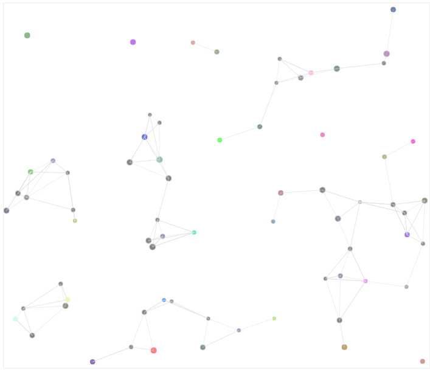

# cartoon.js
an animation library for your web based on canvas</br>
cartoon.js是一个基于Web和Html5的图形动画库，去框架化，功能独立，上手简单易用。</br>
</br>
#####install
```
npm install cartoon
在页面中引入cartoon.min.js文件
```
#####use
```
drawRandomCircles(mycanvas,num)
```
 

developer:</br>
	_Chinese Academy Of Sciences:</br>_
	**朱京乔**</br>
	_Communication University Of China:</br>_
	**邱锐**</br>
